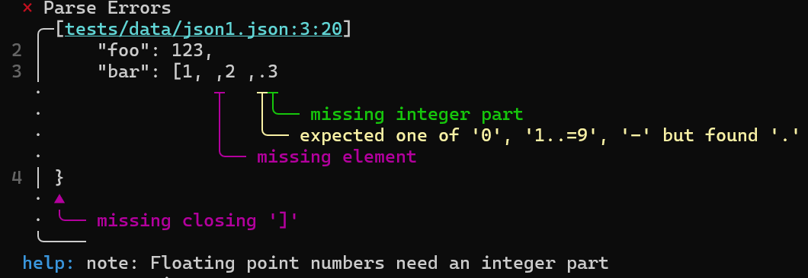

# marser

this is a parser-combinator library for PEG Grammars centered on being able to write grammars in a natural way inside rust code, with a focus on good error messages. I plan to upload this to crates.io once it's more polished.


## Example

A full JSON grammar example is available at `examples/json.rs` and can be run with:

```bash
cargo run --example json -- <path-to-json-file>
```

An example of error messages: 

Parser run with the following input:

```json
{
    "foo": 123,
    "bar": [1, ,2 ,.3
}
```

Produces the following error message:



It also produces a recovered AST:
```json
{
    "foo": 123,
    "bar": [
        1,
        2,
        invalid
    ]
}
```
(this is the the result AST converted back to a string)

you can try this yourself by running the following command:

```bash
cargo run --example json -- tests/data/json1.json
```
## License

This project is licensed under the MIT License.
